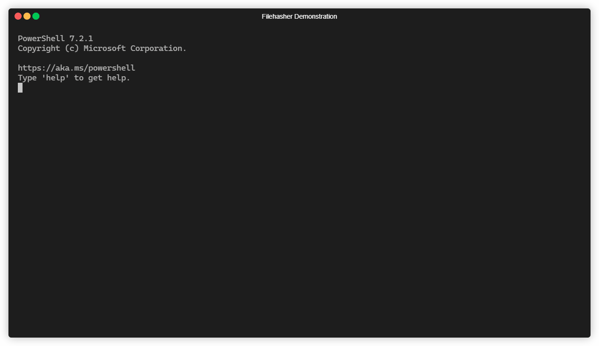

# filehasher

CLI utility, which outputs hash of the given file.

## Usage

`filehasher [OPTIONS] <PATH>`

`<PATH>` - Path to the file

### Options

`-a, --algorithm` - hash algorithm to use.
`md5` by default. For possible values, please see `filehasher --help`
